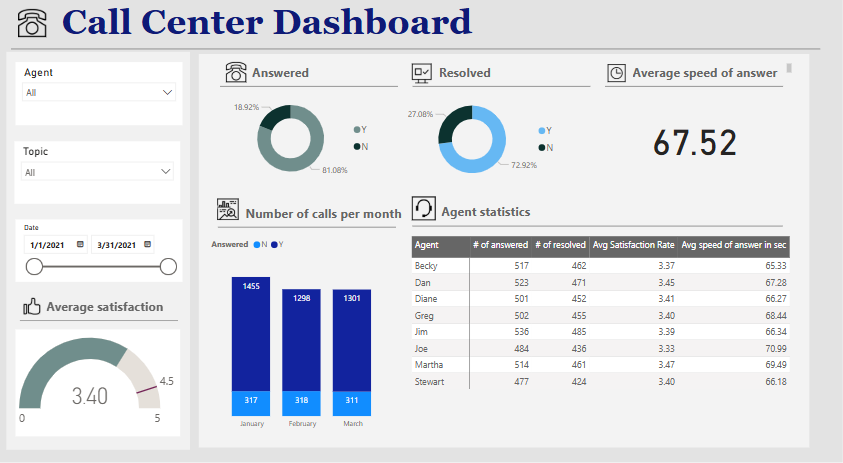

# Call Center Performance Analysis using Power BI

## Table of Contents
- [Introduction](#introduction)
- [Data Source and Structure](#data-source-and-structure)
- [Calculated Measures and DAX Formulas](#calculated-measures-and-dax-formulas)
- [Dashboard Breakdown](#dashboard-breakdown)
  - [Filters and Slicers](#filters-and-slicers)
  - [Answered and Resolved Calls Visuals](#answered-and-resolved-calls-visuals)
  - [Average Speed of Answer](#average-speed-of-answer)
  - [Number of Calls Per Month](#number-of-calls-per-month)
  - [Agent Statistics Table](#agent-statistics-table)
  - [Average Satisfaction Score](#average-satisfaction-score)
  - [Recommendations for Improvement](#recomendations-for-improvement)
- [Conclusion](#conclusion)

## Introduction
The Call Center Dashboard is designed to provide insights into call performance, agent efficiency, and customer satisfaction. It includes key performance metrics such as:
- Number of answered and resolved calls
- Average speed of answer
- Number of calls per month
- Agent performance statistics
- Average satisfaction rating

## Data Source and Structure
The dataset consists of a table named **Call Center**, containing fields such as:
- `Agent`
- `Answered (Y/N)`
- `# of answered`
- `# of resolved`
- `Satisfaction rating`
- `Speed of answer in seconds`
- `Date`
- `Topic`
- `AvgTalkDuration`
- `Resolved (Y/N)`

## Calculated Measures and DAX Formulas
### Total Calls Answered
```DAX
Total_Answered = COUNTROWS(FILTER('Call Center', 'Call Center'[Answered (Y/N)] = "Y"))
```
This measure calculates the total number of answered calls.

Total Calls Resolved
```DAX
Total_Resolved = COUNTROWS(FILTER('Call Center', 'Call Center'[Resolved] = "Y"))
```
This measure counts the number of calls marked as resolved.

## Average Speed of Answer
```DAX
Avg_Speed_of_Answer = AVERAGE('Call Center'[Speed of answer in seconds])
```
This measure computes the average time taken to answer calls.

## Average Satisfaction Score
```DAX
Avg_Satisfaction = AVERAGE('Call Center'[Satisfaction rating])
```
This measure calculates the average satisfaction rating from customers.

## Calls Per Month
```DAX
Calls_Per_Month = COUNTROWS('Call Center')
```
This measure aggregates the total number of calls in each month.

## Dashboard Breakdown


[Interact](https://app.powerbi.com/view?r=eyJrIjoiNTkwZjZhZTEtOTk4OS00NWNhLWJjZWYtOWI4MTVmMTFkNTE3IiwidCI6ImRmODY3OWNkLWE4MGUtNDVkOC05OWFjLWM4M2VkN2ZmOTVhMCJ9)


## Filters and Slicers

Agent: Allows selection of individual agents.

Topic: Enables filtering based on call topics.

Date: A date slicer to view data within a specific range.

## Answered and Resolved Calls Visuals
Two Donut Charts display the percentage of calls answered (Y/N) and resolved (Y/N).

The outer and inner circles help compare the proportions visually.

## Average Speed of Answer
A Card Visualization shows the average speed of answer (67.52 seconds in the example).

This helps track how quickly agents respond to calls.

## Number of Calls Per Month
A Bar Chart visualizes the number of answered and non-answered calls for January, February, and March.

This helps track seasonal variations in call volume.

## Agent Statistics Table
A table displays detailed statistics for each agent, including:

 Number of answered and resolved calls

 Average satisfaction rating

Average speed of answer in seconds

 Average Satisfaction Score
 
A Gauge Visualization shows the average satisfaction score (3.40 out of 5).

This metric helps measure customer experience and agent performance.

## Recommendations for Improvement

# Increase First-Call Resolution (FCR) Rate:

- Provide additional training for agents on common customer issues and troubleshooting techniques.

- Implement a knowledge base to help agents resolve queries efficiently.

- Optimize Staffing and Call Routing:

- Use predictive analytics to allocate resources based on call volume trends.

- Implement an interactive voice response (IVR) system to route calls efficiently.

# Improve Customer Satisfaction Scores:

- Set a target satisfaction score of at least 4.0 and track agent performance.

- Introduce post-call surveys to collect customer feedback and address pain points.

# Reduce Average Speed of Answer:

- Monitor agent response times and set performance benchmarks.

- Increase staffing during peak hours to reduce wait times.

- Enhance Performance Monitoring:

- Introduce real-time monitoring dashboards to track agent performance.

- Conduct monthly performance reviews to identify improvement areas.

## Conclusion
The analysis reveals that while the call center has a high answer rate, there is a need for better resolution rates, faster response times, and improved customer satisfaction. By implementing these recommendations, the call center can enhance efficiency, improve customer experience, and optimize agent performance. 

